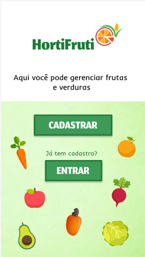
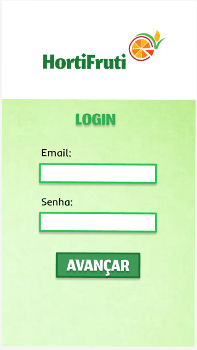
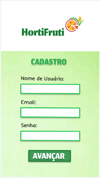
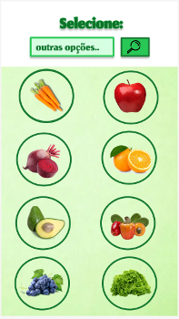
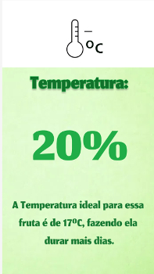
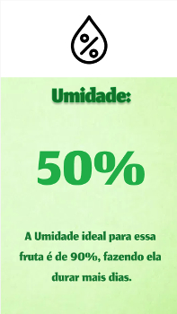
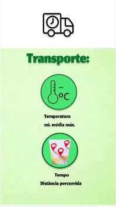
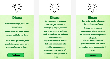

# Seminário de Orientação do Projeto Integrador
CURSO: TECNOLOGIA EM SISTEMAS PARA INTERNET

TEMA: SISTEMA DE GERENCIAMENTO PARA FRUTAS E VERDURAS

GRUPO: 
 FERNANDA BEATRIZ TAVARES GOMES

 POLIANA DE ARAUJO PEREIRA

 JONATHAN LEONCIO DE SOUZA LIRA
 
# Interfaces do Aplicativo (Protótipo)
### Esse trabalho consiste em apresentar capturas do prototipo das interfaces gráficas e suas respectivas descrições para assim informar sobre as funcionalidades e fluxos para o aplicativo que será desenvolvido e utilizado durante o desenvolvimento do Projeto Integrador.

## Interface 1 : Tela Inicial 
### A Interface Inicial do aplicativo, possui uma logomarca (à definir), uma pequena descrição para informar o objetivo do aplicativo ao usuário, um botão para realizar o cadastro dos usuários para poderem assim utilizar o software e um botão para realizar o login quando o usuário ja tiver um cadastro feito.

## Interface 2: Login e Cadastro 
### As Próximas Interfaces são: Cadastro, em que os usuários poderão registrar seus dados, deixando-os armazenados para os próximos acessos os dados que deverão ser preenchidos são Nome da Empresa ou Responsável, email para login e a senha de acesso do sistema, também possui a logomarca para identificação e o botão de confirmação. Já para a tela de realizar login, possui o preenchimento dos dados de email e senha, que haverá a verificação para o login, e o botão para avançar.

## Interface 3 : Menu das frutas/verduras (Poliana)

## Interface 4 : Menu de dados 
### Após escolher a frutas ou verdura que será analisada pelo dispositivo, o usuário será direcionado para a interface contendo um Menu com todos os dados e fluxos que poderão ser apresentados, no caso, botões com seus respectivos caminhos, para analise de dados da temperatura, umidade, ventilação e também fluxos para ambiente adequado, condições no transporte e dicas para melhor conservação desses alimentos.

## Interface 5 : Temperatura (Jonathan)

## Interface 6 : Umidade (Jonathan)

## Interface 7 : Ambiente (Jonathan)

## Interface 8 : Transporte (Poliana)

## Interface 9 : Dicas (Poliana)

